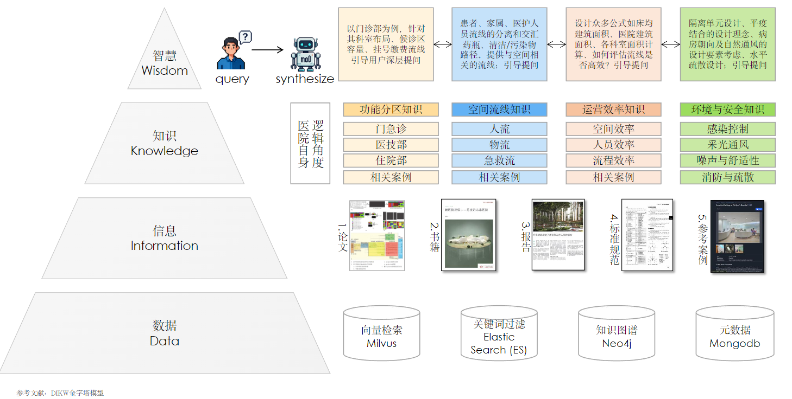
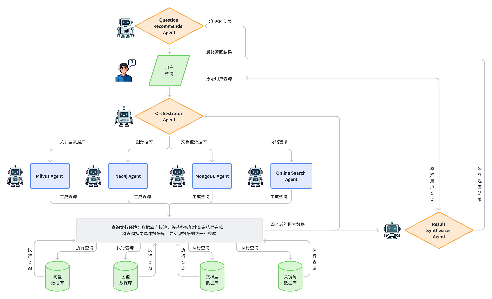

# MediArch：基于 Agentic RAG 的综合医院设计系统

> MediArch: An Agentic RAG System for Comprehensive Hospital Design

可以综合医院相关的规范标准、书籍报告、参考论文、政策文件与在线案例整合为智慧的“设计导师”，把检索变成激发智慧的旅程。

Integrate hospital-related regulations, standards, books, reports, research papers, policy documents, and online case studies into a smart "design mentor," transforming searching into a journey that inspires intelligence.

## 研究介绍（Introduction）

本项目旨在构建一个面向综合医院建筑设计的对话式启发系统，以弥合设计知识与创新灵感之间的鸿沟。传统的查阅与人工检索方式不仅效率低下，还难以实现多源知识的联动与深度融合。针对这一痛点，本研究提出了一种**基于图状知识网络的多源数据库智能体驱动的检索增强生成框架（Graph-Based Agentic RAG）。**

This project aims to build a conversational, inspirational system for comprehensive hospital architectural design. It seeks to bridge the gap between design knowledge and creative inspiration. Traditional manual lookups and searches are not only inefficient but also struggle to link and deeply integrate knowledge from multiple sources.To address this pain point, we propose a **Graph-Based Agentic Retrieval-Augmented Generation (RAG)** framework driven by a multi-source database of intelligent agents.



### 数据源整合方面(Data Source Integration)：

系统以知识图谱为核心，将规范标准、书籍报告、参考论文、政策文件与在线案例等多源知识整合为一个结构化的知识网络。通过多智能体协同驱动 Neo4j、Milvus 与 MongoDB 三类数据库，实现跨源检索与补充，同时能够对建筑师关注的图纸、表格等信息进行清晰返回，使结果图文并茂、信息完整。

At its core, the system uses a knowledge graph to integrate diverse sources—including regulations, standards, books, reports, research papers, policy documents, and online case studies—into a structured knowledge network. By employing a multi-agent system to drive four types of databases (Neo4j, Milvus, Elasticsearch, and MongoDB), we achieve cross-source retrieval and supplementation. This also allows for a clear return of information such as drawings and tables that are critical to architects, providing rich, complete results with both text and images.

### 智能体构建方面(Agentic Framework)：

系统采用 Orchestrator–Worker 架构，驱动四类专项数据库智能体与深度搜索智能体协作完成任务。不同数据库的能力在该架构下得到充分发挥：

1. **Neo4j:** 支持复杂关系建模与知识图谱推理；
2. **Milvus:** 提供亿级向量与多模态数据的高效检索；
3. **MongoDB:** 负责灵活的元数据与文档存储。

The system adopts an **Orchestrator–Worker architecture** to coordinate four specialized database agents and a deep-search agent to complete tasks. This architecture leverages the unique strengths of each database:

1.  **Neo4j:** Supports complex relationship modeling and knowledge graph reasoning.
2.  **Milvus:** Provides efficient retrieval of billions of vectors and multimodal data.
3.  **MongoDB:** Handles flexible metadata and document storage.

### 用户体验层方面(User Experience)：

我们将开发一套前后端一体化的交互界面，用户可通过网页登录并与 MediArch 进行自然交互。系统不仅支持流畅的问答，还将提供智能体调用流程的可视化展示，使用户能够直观理解问题解析与智能体协作过程。未来，我们计划进一步引入 3D 数字虚拟人 与语音交互，为用户提供近似真人对话的沉浸式体验。

We will develop a full-stack, integrated interactive interface where users can log in via a web page and interact naturally with **MediArch**. The system will not only support fluid Q&A but will also provide a visual display of the agent's workflow, allowing users to intuitively understand how their questions are processed and how the agents collaborate. In the future, we plan to introduce a 3D digital avatar and voice interaction to provide a more immersive, human-like conversational experience.

### 最终目标(Final Goal)：

本系统旨在成为医院建筑设计中的一位智慧型“设计伙伴”。在满足知识问询的同时，激发创新思维与人性化考量，从而支持设计师实现从概念构想到细节落地的全过程优化。

Our ultimate goal is for this system to become a smart "design partner" in hospital architectural design. While answering knowledge-based queries, it will also inspire innovative thinking and human-centered considerations, thereby supporting designers in optimizing the entire process from conceptual design to detailed execution.

## 系统架构（System Architecture）

系统采用 Orchestrator–Worker（编排器–工人） 模式组织多智能体协同工作。

- Orchestrator Agent 负责用户 Query 的拆解、意图识别与补充；

- 随后，根据不同类型的数据库，分别调用 Neo4j Agent、Milvus Agent、MongoDB Agent，从多源数据库中检索相关知识，同时结合 Online Search Agent 数据进行补充；

- 检索结果经由查询执行环境流入 Result Synthesizer Agent，对结果进行评价与输出。若答案尚需完善，结果会回流至 Orchestrator_Agent 进行迭代；

- 随后，生成结果交由 Result Synthesizer Agent 进行多源整合，形成完整答案；

- 最终，用户不仅获得优化后的回答，还会收到 Result Synthesizer Agent 提供的相关问题推荐，从而引导更深入的查询与检索。

The Orchestrator Agent is responsible for decomposing, interpreting, and enriching user queries;

- Based on the data source type, specialized agents — Neo4j Agent, Milvus Agent, Elasticsearch Agent, and MongoDB Agent — are invoked to retrieve relevant knowledge, supplemented with online Agent data;

- The retrieved results flow into the Result_Agent, which evaluates and generates preliminary outputs. If refinement is required, the outputs are returned to the Orchestrator Agent for iterative improvement;

- The finalized outputs are then passed to the Result Synthesizer Agent, which consolidates multi-source information into a coherent response;

- Finally, users receive not only the synthesized answer but also contextual recommendations from the Result Synthesizer Agent, guiding further exploration and deeper retrieval.



## 核心技术与挑战（Key Technologies & Challenges）


### 挑战一：知识抽取与本体建模

> Challenge 1: Knowledge Extraction and Ontology Modeling

### 挑战二：数据质量与文档解析

> Challenge 2: Data Quality and Document Parsing

### 挑战三：向量化与文档检索

> Challenge 3: Vectorization and Document Retrieval

### 挑战四：Orchestrator Agent 调度策略

> Challenge 4: Orchestrator Agent Scheduling Strategy

### 挑战五：Result Synthesizer Agent 冲突处理与结果处理

> Challenge 5: Result Synthesizer Agent — Conflict Resolution and Result Processing


## 快速启动命令

#### 1. 启动后端（FastAPI）

在项目根目录下打开终端，执行：

```bash
# 方式 1：直接运行 main.py
python backend/api/main.py

# 方式 2：使用 uvicorn（更灵活）
uvicorn backend.api.main:app --reload --host 0.0.0.0 --port 8000
```

后端服务将在 `http://localhost:8000` 启动

- API 文档：http://localhost:8000/api/docs
- ReDoc 文档：http://localhost:8000/api/redoc

#### 2. 启动前端（Next.js）

**新开一个终端窗口**，在项目根目录下执行：

```bash
# 进入前端目录并启动
cd frontend && pnpm dev

# 或者使用 npm
cd frontend && npm run dev
```

前端服务将在 `http://localhost:3000` 启动


## 环境要求

### 后端依赖
- Python 3.11+
- 已安装项目依赖：`pip install -r requirements.txt`
- 配置好 `.env` 文件（参考 `.env.minimal`）

### 前端依赖
- Node.js 18+
- pnpm 或 npm
- 已安装依赖：`cd frontend && pnpm install`